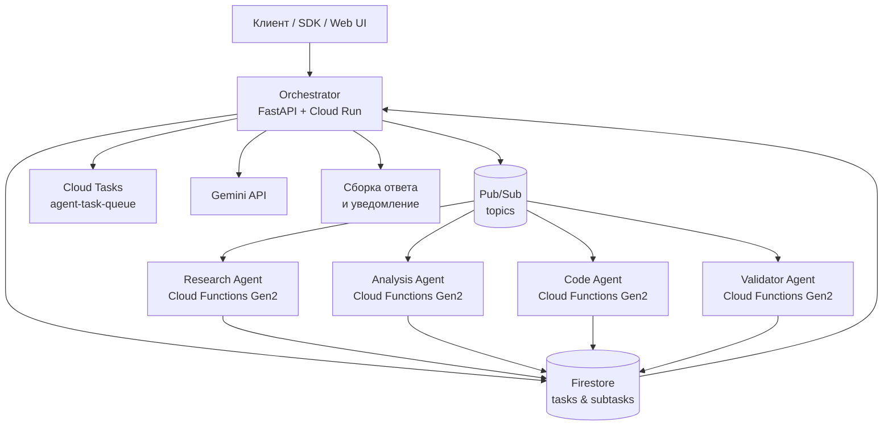

# Multi-Agent AI System on Google Cloud Platform

> 🇷🇺 Русская версия ниже | 🇺🇸 English version below

## 🇷🇺 Русская версия

### Краткое описание
Многоагентная платформа на базе Google Cloud, которая декомпозирует сложные запросы пользователей, распределяет подзадачи между специализированными агентами и собирает проверенный ответ. Оркестратор (FastAPI на Cloud Run) хранит состояние в Firestore, публикует задания в Pub/Sub, при необходимости планирует повторные попытки через Cloud Tasks и использует Gemini для разбиения задач и финальной синтезированной ответа. Четыре агента (Research, Analysis, Code, Validator) развёрнуты как Cloud Functions Gen2 и обращаются к внешним сервисам (web, GitHub, BigQuery). Есть локальный режим без GCP с заглушками для Firestore, Pub/Sub и Gemini.

### Архитектура



Дополнительно используются Secret Manager (хранение ключей), Artifact Registry (образы), Cloud Logging/Monitoring и BigQuery.

### Основные возможности
- Автоматическая декомпозиция задач с помощью Gemini и распределение по типам агентов.
- Параллельная обработка подзадач через Pub/Sub с поддержкой зависимостей и повторных попыток.
- Интеграции с внешними источниками: web-ресурсы, GitHub API, запросы BigQuery.
- Валидатор проверяет согласованность результатов, выполняет факт-чекинг и формирует отчёт.
- Независимое масштабирование агентов (Cloud Functions) и оркестратора (Cloud Run).
- Локальный режим (`LOCAL_MODE=1`) с in-memory реализациями Firestore/PubSub/Gemini для разработки.
- REST API (`/tasks`, `/tasks/{id}`, `/webhook/agent-result`, `/health`) + минимальный фронтенд (`/ui`) и Python SDK.
- Кодовый агент собирает многофайловые пакеты и оркестратор сохраняет ZIP (inline или в GCS).
- Доступны REST-эндпоинты для повторного запуска, отмены и смены приоритета подзадач; UI отображает эти действия.


### Компоненты
- **Orchestrator** (`orchestrator/main.py`) — FastAPI сервис; управляет жизненным циклом задач, хранит состояние, публикует сообщения в Pub/Sub, вызывает Gemini для декомпозиции и финального ответа, сервит статический фронтенд.
- **Research Agent** (`agents/research`) — собирает данные из web, GitHub и BigQuery, синтезирует источники через Gemini и отдаёт структурированные результаты.
- **Analysis Agent** (`agents/analysis`) — выполняет статистику, распознаёт паттерны и сравнивает данные, используя pandas/numpy и Gemini.
- **Code Agent** (`agents/code`) — анализирует репозитории, генерирует или рефакторит код, выделяет фрагменты и рекомендации.
- **Validator Agent** (`agents/validator`) — проверяет результаты других агентов, оценивает качество, выполняет простые факт-чеки и формирует отчёт.
- **Shared utilities** (`shared/`) — общие модели, менеджеры Firestore/PubSub/Cloud Tasks, клиент Gemini, кеш, конфигурация для локального режима.
- **SDK** (`sdk/`) — Python-клиент для интеграции с REST API.
- **Web UI** (`web/`) — Vite/React интерфейс для мониторинга задач; собранные артефакты размещаются рядом с оркестратором.
- **Инфраструктура** (`terraform/`, `deploy.sh`, `scripts/`) — Terraform-модули и bash/Powershell скрипты для настройки GCP и локального запуска.

### Быстрый старт локально (без GCP)
1. Скопируйте пример переменных:
   ```bash
   cp .env.local.example .env
   ```
2. В `.env` установите `LOCAL_MODE=1` и при необходимости задайте `PROJECT_ID=local-dev`.
3. Создайте и активируйте виртуальное окружение Python 3.11:
   ```bash
   python -m venv .venv
   source .venv/bin/activate        # Windows: .\.venv\Scripts\Activate.ps1
   pip install -r orchestrator/requirements.txt
   ```
4. Запустите оркестратор:
   ```bash
   uvicorn orchestrator.main:app --reload --port ${PORT:-8080}
   ```
5. Отправьте тестовый запрос:
   ```bash
   curl -X POST http://localhost:8080/tasks \
     -H "Content-Type: application/json" \
     -d '{"query": "Найди три свежих AI-исследования"}'
   ```
6. На Windows используйте `scripts/run_local.ps1`, чтобы автоматически активировать окружение и запустить uvicorn.
7. (Опционально) Соберите и запустите фронтенд:
   ```bash
   cd web
   npm install
   npm run dev
   ```

`LOCAL_MODE` включает in-memory Firestore/PubSub/Cache и простой генератор ответов, поэтому никакие сервисы GCP и ключи не требуются.

### Развертывание в Google Cloud
1. Аутентифицируйтесь и выберите проект:
   ```bash
   gcloud auth login
   gcloud auth application-default login
   gcloud config set project <PROJECT_ID>
   ```
2. Экспортируйте переменные окружения:
   ```bash
   export PROJECT_ID=<PROJECT_ID>
   export REGION=us-central1
   export GEMINI_API_KEY=<ваш-ключ>
   export GITHUB_TOKEN=<опционально>
   ```
3. Запустите сценарий автоматического деплоя:
   ```bash
   bash deploy.sh
   ```
   Скрипт включает API, создаёт сервисный аккаунт `multi-agent-system`, настраивает Pub/Sub, Cloud Tasks, Firestore, собирает фронтенд и контейнер оркестратора, деплоит Cloud Run и Cloud Functions Gen2.
4. Альтернативно можно применить Terraform:
   ```bash
   cd terraform
   terraform init
   terraform apply
   ```
5. После деплоя обновите переменные окружения для агентов (`ORCHESTRATOR_URL`, `PROJECT_ID`, секреты Gemini/GitHub) через `gcloud functions deploy ... --set-env-vars/--update-secrets`.
6. Настройте Secret Manager для `gemini-api-key` (обязателен) и `github-token` (повышенные квоты GitHub).

### Конфигурация окружения
| Переменная | Назначение | По умолчанию / заметки |
|-----------|------------|------------------------|
| `PROJECT_ID` | Идентификатор GCP проекта | `your-project-id` (локально) |
| `REGION` | Регион развёртывания Cloud Run/Functions/Tasks | `us-central1` |
| `LOCAL_MODE` | Использовать локальные заглушки Firestore/PubSub/Gemini | `0` |
| `PORT` | Порт FastAPI при локальном запуске | `8080` |
| `ALLOWED_ORIGINS` | Разрешённые CORS origins для веб-клиента | `*` |
| `GEMINI_API_KEY` | Ключ для Gemini API | обязателен в облаке |
| `MODEL_ORCHESTRATOR` | Модель для декомпозиции задач и финальной сборки ответа | наследует `GEMINI_MODEL` |
| `MODEL_RESEARCH` | Модель для research-агента | наследует `GEMINI_MODEL` |
| `MODEL_ANALYSIS` | Модель для analysis-агента | наследует `GEMINI_MODEL` |
| `MODEL_CODE` | Модель для code-агента | наследует `GEMINI_MODEL` |
| `MODEL_VALIDATOR` | Модель для validator-агента | наследует `GEMINI_MODEL` |
| `PACKAGE_ARCHIVE_BUCKET` | Имя GCS bucket для хранения ZIP пакетов | не задано (архив возвращается inline) |
| `GITHUB_TOKEN` | Персональный токен для GitHub API | опционально |
| `ORCHESTRATOR_URL` | URL Cloud Run, который вызывают агенты | задаётся после деплоя |
| `GOOGLE_APPLICATION_CREDENTIALS` | JSON сервисного аккаунта для локальной отладки | опционально |


### Поток выполнения задачи
1. Клиент вызывает `POST /tasks` и получает идентификатор задачи.
2. Оркестратор создаёт `TaskContext` в Firestore и переводит статус в `in_progress`.
3. Gemini генерирует список подзадач; каждая сохраняется как документ `SubTask` и публикуется в профильный Pub/Sub топик (при отсутствии зависимостей).
4. Специализированные агенты получают сообщение, выполняют работу (web/GitHub/BigQuery, анализ, код, проверка), обновляют документ подзадачи и сохраняют результат в `agent_results`.
5. Агенты вызывают вебхук `/webhook/agent-result`; оркестратор обновляет контекст, запускает зависимые подзадачи и, когда все завершены, синтезирует финальный ответ через Gemini.
6. Финальный ответ и отчёт валидатора сохраняются в Firestore; по необходимости отправляется уведомление (через Cloud Tasks или сторонний канал).

### Управление подзадачами (REST)
- `POST /tasks/{task_id}/subtasks/{subtask_id}/retry` — повторный запуск подзадачи с необязательным полем `reason`.
- `POST /tasks/{task_id}/subtasks/{subtask_id}/cancel` — отмена ожидающей или выполняющейся подзадачи.
- `POST /tasks/{task_id}/subtasks/{subtask_id}/prioritize` — изменение приоритета (`{"priority": 80, "reason": "..."}`).

Ответ `/tasks/{id}` включает `artifacts` (например, `packages` с архивами) и `events` с историей ручных действий.


### Наблюдаемость и эксплуатация
- Логи оркестратора и агентов доступны в Cloud Logging; локально — в стандартном выводе.
- Firestore хранит полный трейс (`trace_id`, статусы подзадач, результаты агентов).
- Endpoint `/tasks/{id}` возвращает прогресс, ошибки и промежуточные данные.
- Скрипт `monitoring/monitor.py` может периодически опрашивать Firestore и отправлять метрики в Cloud Monitoring.
- `/health` предоставляет быстрый сигнал для проверки запуска.

### Тестирование и контроль качества
- Выполните `pytest` (например, `pytest test_system.py`) для smoke-тестов оркестратора и локальных агентов.
- `scripts/run_checks.ps1` последовательно запускает `ruff`, `black --check`, `mypy` и `pytest`, если инструменты установлены.
- Для безоблачных проверок используйте `LOCAL_MODE=1`; Pub/Sub и Firestore эмулируются, а Gemini заменяется простым генератором.
- Перед деплоем рекомендуется запустить `bash deploy.sh --dry-run` (добавьте флаг в скрипт при необходимости) или `terraform plan`.

### Безопасность
- Используйте выделенный сервисный аккаунт `multi-agent-system` с минимально необходимыми ролями (см. `deploy.sh`).
- Храните секреты в Secret Manager; не добавляйте ключи в `.env` или Git.
- Ограничьте доступ к Cloud Run (например, через IAP) или добавьте проверку токена/HMAC в `/webhook/agent-result`.
- Для GitHub/BigQuery запросов включите квотирование и мониторинг; секреты передавайте через `--update-secrets`.

### Оптимизация стоимости
- Cloud Functions/Run автоматически масштабируются до нуля; настроенные тайм-ауты и повторные попытки позволяют избежать дублирования.
- Pub/Sub поддерживает заказ по `task_id`, что облегчает дедупликацию и DLQ.
- Кеширование (см. `shared/utils.py::CacheManager`) помогает снижать вызовы внешних API.
- В `deploy.sh` добавьте бюджеты и оповещения (GCP Budgets) для контроля расходов.

### Дорожная карта
- [ ] Добавить дополнительные агенты (например, работа с изображениями или перевод).
- [ ] Реализовать обратную связь от пользователей для автоулучшения агентов.
- [ ] Подключить WebSocket/Server-Sent Events для стриминга прогресса.
- [ ] Создать полноценную дашборд-панель (web) с историей задач.
- [ ] Ввести систему плагинов для подключения кастомных агентов.

### Поддержка и вклад
- Сообщайте о проблемах через GitHub Issues и обсуждения.
- Перед PR выполните `scripts/run_checks.ps1` или аналогичные проверки в CI.
- PR должен включать описание сценария, тесты (при необходимости) и обновлённую документацию.

### Лицензия и контакты
- Проект распространяется по лицензии MIT (см. `LICENSE`).
- Для бизнес-вопросов пишите на `team@example.com`.

