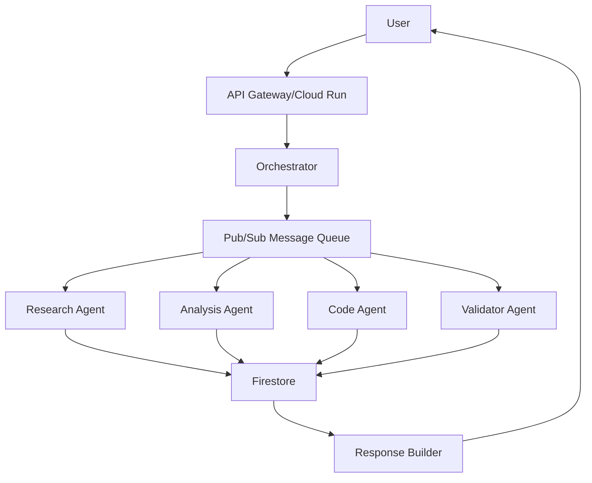

# Multi-Agent AI System on Google Cloud Platform

## 🚀 Overview

A production-ready multi-agent AI system that orchestrates specialized agents to solve complex tasks through parallel processing and intelligent coordination. Built on GCP with modern cloud-native architecture.

## 🏗️ Architecture



## 🎯 Key Features

- **Parallel Processing**: Agents work simultaneously on different aspects of a task
- **Intelligent Task Decomposition**: Uses Gemini AI to break complex queries into subtasks
- **Fault Tolerance**: Individual agent failures don't crash the entire system
- **Scalability**: Each agent scales independently based on workload
- **Asynchronous Communication**: Non-blocking message passing via Pub/Sub
- **State Management**: Centralized state tracking in Firestore
- **Monitoring**: Built-in logging and tracing for debugging

## 📦 Components

### Orchestrator
- **Role**: Main coordinator that manages task lifecycle
- **Technology**: Cloud Run + FastAPI
- **Responsibilities**:
  - Task decomposition using Gemini
  - Agent dispatch and coordination
  - Result aggregation
  - Error handling

### Specialized Agents

#### 1. Research Agent
- **Purpose**: Information gathering and data retrieval
- **Capabilities**:
  - Web research and scraping
  - BigQuery dataset queries
  - GitHub API integration
  - External API calls

#### 2. Analysis Agent
- **Purpose**: Data analysis and insight generation
- **Capabilities**:
  - Statistical analysis
  - Pattern recognition
  - Trend identification
  - Comparison analysis

#### 3. Code Agent
- **Purpose**: Code-related tasks
- **Capabilities**:
  - Code generation
  - Repository analysis
  - Code review
  - Refactoring suggestions

#### 4. Validator Agent
- **Purpose**: Quality assurance
- **Capabilities**:
  - Result validation
  - Fact checking
  - Consistency verification

## 🛠️ Setup Instructions

### Prerequisites

1. **GCP Account** with billing enabled
2. **Google Cloud SDK** installed (`gcloud` CLI)
3. **Terraform** installed (v1.0+)
4. **Docker** installed
5. **Python 3.11+** installed
6. **Gemini API Key** from Google AI Studio

### Local quickstart (no GCP required)

If you just want to try the orchestrator flow locally without provisioning any Google Cloud resources:

1. Copy `.env.local.example` to `.env` and adjust the values if you want a different `PROJECT_ID` or port:
   ```bash
   cp .env.local.example .env
   ```
   Environment variables:
   - `LOCAL_MODE` — must be `1` to enable the in-memory stores and stubbed agents.
   - `PROJECT_ID` — any string, used only for logging in local mode.
   - `PORT` — port for the FastAPI server (default `8080`).
2. Ensure Python 3.11 is available. On Windows use `py -3.11 -m venv .venv`; on macOS/Linux run `python3.11 -m venv .venv`.
3. Activate the virtual environment and install orchestrator dependencies:
   ```bash
   source .venv/bin/activate         # On Windows: .\.venv\Scripts\Activate.ps1
   pip install -r orchestrator/requirements.txt
   ```
4. Run the orchestrator API:
   ```bash
   uvicorn orchestrator.main:app --reload --port ${PORT:-8080}
   ```
5. Submit a demo task:
   ```bash
   curl -X POST http://localhost:8080/tasks \
     -H "Content-Type: application/json" \
     -d '{"query": "Summarise three new AI research breakthroughs"}'
   ```

In `LOCAL_MODE` all Google Cloud services and Gemini calls are replaced with fast in-process mocks, so you don't need a service account or API keys. The response is synthetic but follows the same structure as the cloud deployment.

### Step 1: Clone Repository

```bash
git clone https://github.com/your-org/multi-agent-system.git
cd multi-agent-system
```

### Step 2: Configure Environment

```bash
# Set your project ID
export PROJECT_ID="your-gcp-project-id"
export REGION="us-central1"

# Authenticate with GCP
gcloud auth login
gcloud config set project $PROJECT_ID
```

#### Required environment variables (cloud deployment)

| Variable | Purpose | Where to get it |
|----------|---------|-----------------|
| `PROJECT_ID` | Target Google Cloud project | `gcloud projects list` or Cloud Console |
| `REGION` | Region for Cloud Run/Functions (e.g. `us-central1`) | Choose any supported region |
| `GEMINI_API_KEY` | Access token for Gemini API | [Google AI Studio](https://ai.google.dev/) → *Get API key* |
| `ORCHESTRATOR_URL` | Base URL of the deployed orchestrator (`https://...`) used by agents to post results | Automatically set by `deploy.sh`; set manually if invoking agents outside the script |
| `GOOGLE_APPLICATION_CREDENTIALS` | Path to service-account JSON with Firestore/PubSub/Tasks access | Create in Cloud Console → IAM & Admin → Service Accounts |

These variables are loaded automatically if you place them in a `.env` file (thanks to `python-dotenv`) or export them in your shell before running deployments/tests.

### Step 3: Set Up Secrets

```bash
# Create Gemini API key secret
echo -n "your-gemini-api-key" | gcloud secrets create gemini-api-key \
    --data-file=- \
    --replication-policy="automatic"

# Create GitHub token (optional)
echo -n "your-github-token" | gcloud secrets create github-token \
    --data-file=- \
    --replication-policy="automatic"
```

### Step 4: Deploy Infrastructure

```bash
# Run deployment script
chmod +x deploy.sh
./deploy.sh $PROJECT_ID $REGION

# Or manually with Terraform
cd terraform
terraform init
terraform apply -var="project_id=$PROJECT_ID" -var="region=$REGION"
```

### Step 5: Deploy Services

```bash
# Build and deploy Orchestrator
cd orchestrator
gcloud builds submit --tag gcr.io/$PROJECT_ID/orchestrator
gcloud run deploy orchestrator-service \
    --image gcr.io/$PROJECT_ID/orchestrator \
    --region $REGION

# Deploy Cloud Functions (agents)
cd ../agents/research
gcloud functions deploy research-agent \
    --gen2 \
    --runtime python311 \
    --trigger-topic agent-research-tasks

# Repeat for other agents...
```

## 📝 Usage Examples

### Basic Task Submission

```python
import requests

orchestrator_url = "https://orchestrator-xxxxx.run.app"

# Submit a task
task = {
    "query": "Find top 5 AI projects on GitHub and analyze their tech stack",
    "metadata": {"priority": "high"}
}

response = requests.post(f"{orchestrator_url}/tasks", json=task)
task_id = response.json()["task_id"]

# Check status
status = requests.get(f"{orchestrator_url}/tasks/{task_id}")
print(status.json())
```

### Complex Multi-Step Query

```python
complex_task = {
    "query": """
    1. Research the latest trends in serverless computing
    2. Find the top 10 serverless frameworks on GitHub
    3. Analyze their architectures and compare performance
    4. Generate a Python script to deploy a simple serverless function
    5. Provide recommendations for choosing a framework
    """,
    "metadata": {
        "require_code_generation": True,
        "depth": "comprehensive"
    }
}

response = requests.post(f"{orchestrator_url}/tasks", json=complex_task)
```

## 🔍 Monitoring & Debugging

### View Logs

```bash
# Orchestrator logs
gcloud run logs read --service orchestrator-service

# Agent logs
gcloud functions logs read research-agent

# Pub/Sub message flow
gcloud pubsub subscriptions pull agent-task-dispatch-sub --auto-ack
```

### Monitor Metrics

```bash
# View Cloud Run metrics
gcloud monitoring metrics-descriptors list --filter="metric.type:run.googleapis.com"

# View Firestore operations
gcloud firestore operations list
```

### Debug Failed Tasks

```python
# Query Firestore for task details
from google.cloud import firestore

db = firestore.Client()
task = db.collection('tasks').document(task_id).get()
print(task.to_dict())

# Check subtask statuses
subtasks = db.collection('subtasks').where('parent_task_id', '==', task_id).stream()
for subtask in subtasks:
    print(subtask.to_dict())
```

## 🎨 Customization

### Adding a New Agent

1. **Create agent code** in `agents/new_agent/`:

```python
# agents/sentiment/main.py
import functions_framework

@functions_framework.cloud_event
def handle_message(cloud_event):
    # Your agent logic here
    pass
```

2. **Add Pub/Sub topic** in Terraform:

```hcl
resource "google_pubsub_topic" "agent_sentiment" {
  name = "agent-sentiment-tasks"
}
```

3. **Update Orchestrator** to recognize new agent:

```python
class AgentType(Enum):
    # ...
    SENTIMENT = "sentiment"
```

4. **Deploy the new agent**:

```bash
gcloud functions deploy sentiment-agent \
    --trigger-topic agent-sentiment-tasks
```

### Modifying Task Decomposition

Edit the Gemini prompt in `orchestrator/main.py`:

```python
def decompose_task(self, user_query: str):
    prompt = f"""
    # Customize this prompt for your use case
    Given this query: {user_query}
    
    Break it down for these agents:
    - Your custom agents here
    
    Return as JSON: [...]
    """
```

## 🚨 Troubleshooting

### Common Issues

1. **Timeout Errors**
   - Increase Cloud Function timeout: `--timeout 540s`
   - Check agent processing logic for bottlenecks

2. **Permission Denied**
   - Ensure service account has required roles
   - Check Pub/Sub subscription permissions

3. **Agent Not Responding**
   - Verify Pub/Sub topic connections
   - Check Cloud Function logs for errors

4. **High Costs**
   - Set up budget alerts
   - Implement caching in Firestore
   - Use Cloud Function minimum instances wisely

## 📊 Performance Optimization

### Caching Strategy

```python
# Implement in shared/utils.py
cache_manager = CacheManager(firestore_client)

# Cache expensive operations
cached_result = cache_manager.get(cache_key)
if not cached_result:
    result = expensive_operation()
    cache_manager.set(cache_key, result, ttl=3600)
```

### Batch Processing

```python
# Process multiple subtasks together
batch = firestore_client.batch()
for subtask in subtasks:
    doc_ref = firestore_client.collection('subtasks').document()
    batch.set(doc_ref, subtask.to_dict())
batch.commit()
```

## 🔒 Security Best Practices

1. **API Authentication**: Enable Cloud Run authentication
2. **Secret Management**: Use Secret Manager for all credentials
3. **Network Security**: Configure VPC for internal communication
4. **Data Encryption**: Enable Firestore encryption at rest
5. **Rate Limiting**: Implement API rate limits

## 💰 Cost Estimation

| Component | Estimated Monthly Cost |
|-----------|----------------------|
| Cloud Run (Orchestrator) | $10-50 |
| Cloud Functions (4 agents) | $20-100 |
| Firestore | $10-30 |
| Pub/Sub | $5-20 |
| Gemini API | $50-200 |
| **Total** | **$95-400** |

*Costs vary based on usage. Set up budget alerts!*

## 🗺️ Roadmap

- [ ] Add more specialized agents (Image Analysis, Translation)
- [ ] Implement agent self-improvement through feedback loops
- [ ] Add WebSocket support for real-time updates
- [ ] Create web UI dashboard
- [ ] Implement agent marketplace
- [ ] Add support for custom agent plugins

## 📚 Resources

- [Google Cloud Documentation](https://cloud.google.com/docs)
- [Gemini API Documentation](https://ai.google.dev/docs)
- [Pub/Sub Patterns](https://cloud.google.com/pubsub/docs/patterns)
- [Cloud Run Best Practices](https://cloud.google.com/run/docs/tips)

## 🤝 Contributing

1. Fork the repository
2. Create feature branch (`git checkout -b feature/NewAgent`)
3. Commit changes (`git commit -am 'Add new agent'`)
4. Push to branch (`git push origin feature/NewAgent`)
5. Create Pull Request

## 📄 License

MIT License - see LICENSE file for details

## 🆘 Support

- **Issues**: GitHub Issues
- **Discussions**: GitHub Discussions
- **Email**: team@example.com

---

Built with ❤️ using Google Cloud Platform
